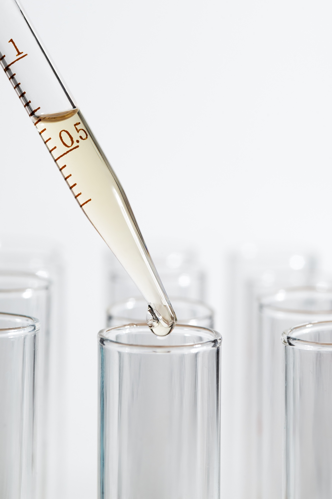
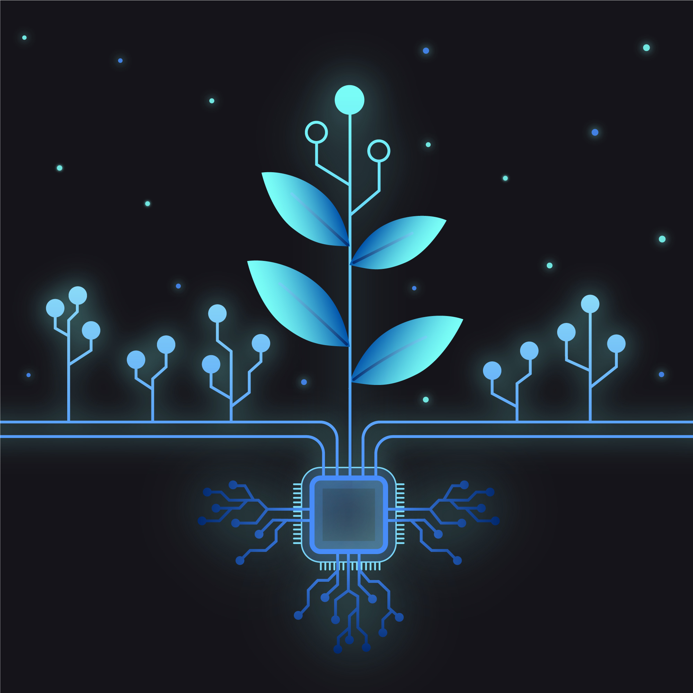

<!DOCTYPE html>
<html lang="es">
<head>
  <meta charset="UTF-8" />
  <meta name="viewport" content="width=device-width, initial-scale=1.0"/>
  <title>Andrea Clemente-Ureña - Portfolio</title>
  
</head>
<body>

<!-- Botón para alternar idioma -->
<button id="language-toggle" onclick="toggleLanguage()">English</button>

<header>
  <h1>
    👩‍🔬 Andrea Clemente-Ureña
    👩‍🔬 Andrea Clemente-Ureña
  </h1>
  

    Aquí comparto mi trayectoria en <strong>biología</strong>, <strong>bioinformática</strong>, <strong>robótica</strong> y <strong>visión computacional 3D</strong>.
    Here I share my journey in <strong>biology</strong>, <strong>bioinformatics</strong>, <strong>robotics</strong> and <strong>3D computer vision</strong>.
  

  

    <strong>Investigadora predoctoral</strong> en UPM y CRF-INIA-CSIC | Proyecto: Transformación digital de la conservación y mejora vegetal
    <strong>Predoctoral Researcher</strong> at UPM and CRF-INIA-CSIC | Project: Digital Transformation of Plant Conservation and Improvement
  

</header>

<!-- Sección: Bienvenida (siempre visible) -->
<section id="bienvenida">
  <h2 class="section-title">
    ¡Bienvenid@ a mi portfolio!
    Welcome to my portfolio!
  </h2>
  
  
 
    

      Este espacio reúne mi trayectoria en <strong>biología</strong>, <strong>bioinformática</strong>, <strong>robótica</strong> y <strong>visión computacional 3D</strong>. Actualmente desarrollo herramientas avanzadas para el <strong>fenotipado de cultivos</strong> y la <strong>caracterización de estructuras vegetales</strong>, aplicando aprendizaje automático y análisis de datos. <strong>Si te interesa mi trabajo, ¡Haz click en las siguientes imágenes!</strong> 
      This space brings together my journey in <strong>biology</strong>, <strong>bioinformatics</strong>, <strong>robotics</strong> and <strong>3D computer vision</strong>. I currently develop advanced tools for <strong>crop phenotyping</strong> and <strong>plant structure characterization</strong> using machine learning and data analysis. <strong>If you're interested in my work, click on the following images!</strong>
    

    

      📍 Investigadora predoctoral en la Universidad Politécnica de Madrid (UPM) y el Centro de Recursos Fitogenéticos (CRF-INIA-CSIC), dentro del proyecto <strong>Transformación digital de las actividades de conservación y mejora vegetal</strong>.
      📍 Predoctoral researcher at the Polytechnic University of Madrid (UPM) and the Plant Genetic Resources Center (CRF-INIA-CSIC), within the project <strong>Digital Transformation of Plant Conservation and Improvement</strong>.
    

  

</section>

<!-- Sección: Mi primer contacto con la investigación -->
<section id="primer-contacto-section">
  <h2 class="section-title">
    💡 Mi primer contacto con la investigación
    💡 My first encounter with research
  </h2>
  
  

    

      Mi primer contacto con la investigación fue en 1º de Bachillerato, cuando desarrollé un proyecto sobre la <em>síntesis de bioplásticos a partir de la leche de vaca</em> en las asignaturas de Biología y Técnicas Experimentales en Ciencias. Ese mismo año participé en el <strong>Finde Científico</strong>, formando parte de un equipo que realizaba experimentos de química visual para la divulgación científica.
      My first encounter with research was in the first year of high school when I developed a project on the <em>synthesis of bioplastics from cow's milk</em> in Biology and Experimental Techniques classes. That same year, I participated in the Science Weekend (Finde Científico), as part of a team performing visual chemistry experiments for science outreach.
    

    

      
      
    

  

</section>

<!-- Sección: Proyectos destacados -->
<section id="proyectos-section">
  <h2 class="section-title">
    🚀 Proyectos destacados
    🚀 Featured Projects
  </h2>
  
  

    <!-- Miniaturas de cada proyecto -->
    

      

        
      

      

        
      

      

        
      

      

        
      

      

        
      

    

    <!-- Detalles de cada proyecto -->
    

      

        Fenotipado automatizado de cultivos con robótica y visión computacional. Diseño experimental y análisis de datos fenotípicos.
        Automated crop phenotyping with robotics and computer vision. Experimental design and phenotypic data analysis.
      

    

    

      

        TFM: Identificación y caracterización de tRFs sobreexpresados en enfermedad de Huntington. DOI: <a href="https://doi.org/10.13140/RG.2.2.33680.32001" target="_blank">10.13140/RG.2.2.33680.32001</a>
        Master's Thesis: Identification and characterization of overexpressed tRFs in Huntington's disease. DOI: <a href="https://doi.org/10.13140/RG.2.2.33680.32001" target="_blank">10.13140/RG.2.2.33680.32001</a>
      

    

    

      

        
  TFG: Caracterización estructural de genes codificantes de proteínas ribosómicas en Leishmania. DOI: 
  <a href="https://doi.org/10.13140/RG.2.2.10192.21767" target="_blank">10.13140/RG.2.2.10192.21767</a>. 
  Participación mencionada en el 
  <a href="https://www.cbm.uam.es/wp-content/uploads/2024/07/CBM-Scientific-Report-2021-2022.pdf" target="_blank">
    Informe Científico del CBMSO-CSIC 2021–2022
  </a>.

  Bachelor's Thesis: Structural characterization of genes coding for ribosomal proteins in Leishmania. DOI: 
  <a href="https://doi.org/10.13140/RG.2.2.10192.21767" target="_blank">10.13140/RG.2.2.10192.21767</a>. 
  Participation mentioned in the 
  <a href="https://www.cbm.uam.es/wp-content/uploads/2024/07/CBM-Scientific-Report-2021-2022.pdf" target="_blank">
    CBMSO-CSIC Scientific Report 2021–2022
  </a>.

      

    

    

      

        Proyecto sobre detección inmunohistoquímica de BRCA en cáncer de mama durante el FPII.
        Project on immunohistochemical detection of BRCA in breast cancer during FPII.
      

    

    

      

        Colaboración con el Centro de Automática y Robótica (CAR-CSIC-UPM) para desarrollar soluciones con Microsoft HoloLens2 en aplicaciones agrícolas. (Proyecto en fase inicial)
        Collaboration with the Center for Automation and Robotics (CAR-CSIC-UPM) to develop solutions with Microsoft HoloLens2 in agricultural applications. (Initial project)
      

    

  

</section>

<!-- Sección: Formación académica -->
<section id="formacion-section">
  <h2 class="section-title">
    🎓 Formación académica
    🎓 Academic Education
  </h2>
  
  

    <ul>
      <li>
        📘 <strong>Doctorado en Automática y Robótica</strong> (2024 - actualidad) - Universidad Politécnica de Madrid – INIA-CSIC
        📘 <strong>PhD in Automation and Robotics</strong> (2024 - Present) - Polytechnic University of Madrid – INIA-CSIC
      </li>
      <li>
        📊 <strong>Máster en Bioinformática y Bioestadística</strong> (2022 - 2024) - Universitat Oberta de Catalunya / Universitat de Barcelona
        📊 <strong>Master in Bioinformatics and Biostatistics</strong> (2022 - 2024) - Open University of Catalonia / University of Barcelona
      </li>
      <li>
        🧬 <strong>Grado en Biología</strong> (2016 - 2021) - Universidad Autónoma de Madrid
        🧬 <strong>Bachelor in Biology</strong> (2016 - 2021) - Autonomous University of Madrid
      </li>
      <li>
        🔬 <strong>Técnico Superior en Anatomía Patológica y Citología</strong> (2014 - 2016) - CESUR II
        🔬 <strong>Higher Technician in Pathological Anatomy and Cytology</strong> (2014 - 2016) - CESUR II
      </li>
    </ul>
  

</section>

<!-- Sección: Tecnologías y herramientas -->
<section id="tecnologias-section">
  <h2 class="section-title">
    🛠️ Tecnologías y herramientas
    🛠️ Technologies and Tools
  </h2>
  
  

    <table>
      <tr>
        <td><strong>
          Lenguajes
          Languages
        </strong></td>
        <td>Python • R • SQL • BASH • HTML/CSS</td>
      </tr>
      <tr>
        <td><strong>
          Ciencia &amp; Bioinfo
          Science &amp; Bioinformatics
        </strong></td>
        <td>Bioconductor • SPSS • Galaxy • Novopath • Inferencia estadística</td>
      </tr>
      <tr>
        <td><strong>
          IA / Visión
          AI / Vision
        </strong></td>
        <td>OpenCV • PyTorch • TensorFlow • Scikit-learn • Visión 3D</td>
      </tr>
      <tr>
        <td><strong>
          Robótica
          Robotics
        </strong></td>
        <td>Sensores RGB • Sensores Multiespectrales • Sensores LiDAR/ToF • HoloLens 2</td>
      </tr>
      <tr>
        <td><strong>
          Entornos
          Environments
        </strong></td>
        <td>Linux • VS Code • Git • Office</td>
      </tr>
    </table>
  

</section>

<!-- Sección: Experiencia profesional -->
<section id="experiencia-section">
  <h2 class="section-title">
    📚 Experiencia profesional
    📚 Professional Experience
  </h2>
  
  

    <ul>
      <li>
        🔬 <strong>Investigadora Predoctoral</strong> | INIA-CSIC (2024 - actualidad) 
          Fenotipado automatizado de cultivos con robótica y visión computacional. Diseño experimental y análisis de datos fenotípicos.
        🔬 <strong>Predoctoral Researcher</strong> | INIA-CSIC (2024 - Present) 
          Automated crop phenotyping with robotics and computer vision. Experimental design and phenotypic data analysis.
      </li>
      <li>
        🧫 <strong>Técnico de Anatomía Patológica</strong> | HM Hospitales (2016) 
          Procesamiento y análisis de muestras biológicas y técnicas histológicas.
        🧫 <strong>Pathological Anatomy Technician</strong> | HM Hospitales (2016) 
          Processing and analysis of biological samples and histological techniques.
      </li>
      <li>
        📞 <strong>Teleoperadora Comercial</strong> | My Assessor Total (2021) 
          Primer contacto con el mundo laboral. Aprender cómo funciona el empleo fuera del ámbito científico.
        📞 <strong>Commercial Operator</strong> | My Assessor Total (2021) 
          First contact with the working world. Learning how employment works outside the scientific field.
      </li>
    </ul>
  

</section>

<!-- Sección: Idiomas -->
<section id="idiomas-section">
  <h2 class="section-title">
    🌐 Idiomas
    🌐 Languages
  </h2>
  
  

    <ul>
      <li>🇪🇸 Español: Nativo🇪🇸 Spanish: Native</li>
      <li>🇬🇧 Inglés: Nivel C (APTIS - British Council)🇬🇧 English: Level C (APTIS - British Council)</li>
      <li>🇫🇷 Francés: Nivel A2 (DELF)🇫🇷 French: Level A2 (DELF)</li>
    </ul>
  

</section>

<!-- Sección: Contacto (datos) -->
<section id="contacto-section">
  <h2 class="section-title">
    📫 Contacto
    📫 Contact
  </h2>
  
  

    <ul>
      <li>✉️ Email:✉️ Email: <a href="mailto:andeande.ac@gmail.com">andeande.ac@gmail.com</a></li>
      <li>🔗 LinkedIn:🔗 LinkedIn: <a href="https://www.linkedin.com/in/andreaclementeure%C3%B1a/" target="_blank">https://www.linkedin.com/in/andreaclementeure%C3%B1a/</a></li>
      <li>💻 GitHub:💻 GitHub: <a href="https://github.com/andyacment" target="_blank">https://github.com/andyacment</a></li>
    </ul>
  

</section>

<!-- Formulario de contacto -->
<form id="contact-form">
  <h2>
    Formulario de Contacto
    Contact Form
  </h2>
  <label for="name">
    Nombre
    Name
  </label>
  <input type="text" id="name" name="name" required>
  
  <label for="email">
    Correo electrónico
    Email
  </label>
  <input type="email" id="email" name="email" required>
  
  <label for="message">
    Mensaje
    Message
  </label>
  <textarea id="message" name="message" rows="5" required></textarea>
  <input type="submit" value="Enviar">
</form>

<footer>
  

    "La IA no es el enemigo, es la lupa que amplifica lo que la ciencia aún no alcanza." 🤖🔬🌍
    "AI is not the enemy; it is the magnifying glass that amplifies what science has not yet reached." 🤖🔬🌍
  

</footer>

</body>
</html>
