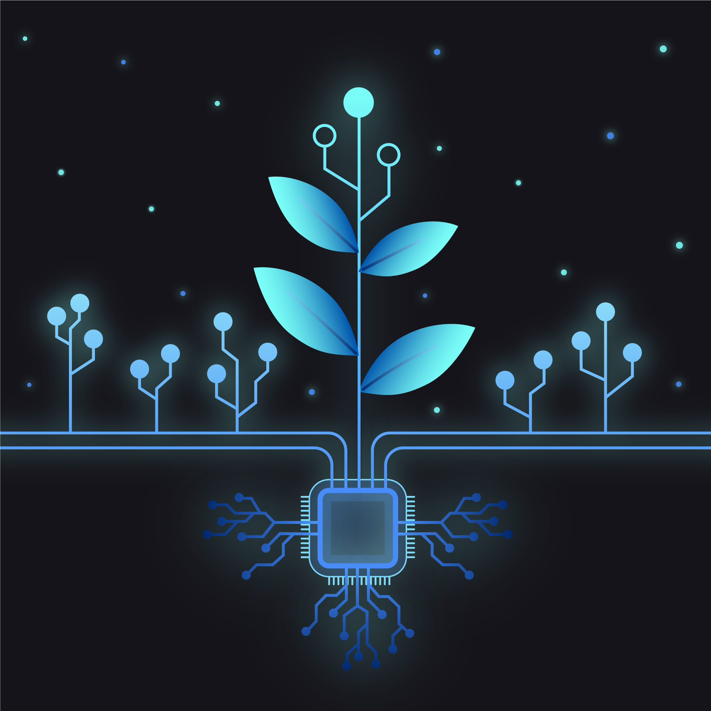

<html lang="es">
<head>
  <meta charset="UTF-8" />
  <meta name="viewport" content="width=device-width, initial-scale=1.0"/>
  <title>Andrea Clemente-Ureña - Portfolio</title>
  
</head>
<body>

<button id="language-toggle" onclick="toggleLanguage()">English</button>

<header>
  <h1>
    👩‍🔬 Andrea Clemente-Ureña
    👩‍🔬 Andrea Clemente-Ureña
  </h1>
  

    Aquí comparto mi trayectoria en <strong>biología</strong>, <strong>bioinformática</strong> y en el desarrollo de sistemas de <strong>fenotipado de alto rendimiento</strong> mediante <strong>robótica</strong> e <strong>inteligencia artificial</strong>, con énfasis en <strong>visión computacional 3D</strong>.
    I share my background in <strong>biology</strong>, <strong>bioinformatics</strong>, and the development of <strong>high-throughput phenotyping</strong> systems using <strong>robotics</strong> and <strong>artificial intelligence</strong>, with a focus on <strong>3D computer vision</strong>.
  

  
<strong>Investigadora predoctoral</strong> en la <strong>Universidad Politécnica de Madrid (UPM)</strong> y el <strong>Centro de Recursos Fitogenéticos (CRF)</strong> del 
  <strong>Instituto Nacional de Investigación y Tecnología Agraria y Alimentaria (INIA)</strong>, parte del <strong>Consejo Superior de Investigaciones Científicas (CSIC)</strong>.

  
Proyecto: Transformación digital de las actividades de conservación y mejora vegetal mediante fenotipado de alto rendimiento (HTP).

  
<strong>PhD researcher</strong> at the <strong>Technical University of Madrid (UPM)</strong> and the 
  <strong>Center for Plant Genetic Resources (CRF)</strong> at the <strong>National Institute for Agricultural and Food Research and Technology (INIA)</strong>, which is part of the <strong>Spanish National Research Council (CSIC)</strong>.

  
Project: Digital transformation of plant genetic resource conservation and crop improvement activities through high-throughput phenotyping (HTP).

</header>

<section id="bienvenida" class="direct-section">
  <h2 class="section-title">
    ¡Bienvenid@ a mi portfolio!
    Welcome to my portfolio!
  </h2>
  
  
  
<!-- Español -->

  
Actualmente desarrollo herramientas avanzadas para el <strong>fenotipado de alto rendimiento (HTP)</strong> aplicado a <strong>cultivos</strong> y a la <strong>caracterización estructural de plantas</strong>, utilizando <strong>Deep Learning</strong> y <strong>análisis computacional de rasgos fenotípicos</strong>.

  
<strong>¡Haz clic en las imágenes para ver mis proyectos!</strong>

<!-- Inglés -->

  
I currently develop advanced tools for <strong>high-throughput phenotyping (HTP)</strong> applied to <strong>crop analysis</strong> and <strong>plant structural characterization</strong>, using <strong>Deep Learning</strong> and <strong>computational analysis of phenotypic traits</strong>.

  
<strong>Click on the images to explore my projects!</strong>

    <a href="#autorreflexion-section" class="lang-es">🧠 Leer sobre mi autorreflexión</a>  
    <a href="#autorreflexion-section" class="lang-en">🧠 Read about my self-reflection</a>
  

</section>

<section class="direct-section">
  <table class="nav-table">
    <tr>
      <td>
        <a href="#primer-contacto-section">
          Mi primer contacto con la investigación
          My initial experience with research
        </a>
      </td>
      <td>
        <a href="#proyectos-section">
          Proyectos destacados
          Featured Projects
        </a>
      </td>
      <td>
        <a href="#formacion-section">
          Formación académica
          Academic Education
        </a>
      </td>
      <td>
        <a href="#tecnologias-section">
          Tecnologías y herramientas
          Technologies &amp; Tools
        </a>
      </td>
      <td>
        <a href="#experiencia-section">
          Experiencia Profesional
          Professional Experience
        </a>
      </td>
      <td>
        <a href="#idiomas-section">
          Idiomas
          Languages
        </a>
      </td>
      <td>
        <a href="#contacto-section">
          Contacto
          Contact
        </a>
      </td>
    </tr>
  </table>
</section>

<!-- Sección: Mi primer contacto con la investigación -->
<section id="primer-contacto-section" class="direct-section">
  <h2 class="section-title">
    💡 Mi primer contacto con la investigación
    💡 My first encounter with research
  </h2>

  

    
      Mi primer contacto con la investigación fue en 1º de Bachillerato en el <strong>IES Alameda de Osuna</strong>, donde desarrollé un proyecto sobre la <em>síntesis de bioplásticos a partir de leche de vaca</em> en las asignaturas de Biología y Técnicas Experimentales en Ciencias. Ese mismo año participé en el <strong>Finde Científico</strong> con el proyecto <em>“De la magia del arco iris al modelo de Bohr”</em>, formando parte de un equipo dedicado a la divulgación científica mediante experimentos de química visual.  
       El Finde Científico es una feria organizada por la <strong>Fundación Española para la Ciencia y la Tecnología (FECYT)</strong> y el <strong>Museo Nacional de Ciencia y Tecnología (MUNCYT)</strong>, con la colaboración de <strong>Obra Social “la Caixa”</strong>.
    

    
      My first experience with research took place during the first year of upper secondary school at <strong>IES Alameda de Osuna</strong>, where I developed a project on the <em>synthesis of bioplastics from cow’s milk</em> in Biology and Experimental Science Techniques. That same year, I took part in the <strong>Finde Científico</strong> with the project <em>“De la magia del arco iris al modelo de Bohr”</em>, as part of a team focused on science outreach through visual chemistry experiments.  
       The Finde Científico is a science fair organized by the <strong>Spanish Foundation for Science and Technology (FECYT)</strong> and the <strong>National Museum of Science and Technology (MUNCYT)</strong>, with support from <strong>Obra Social “la Caixa”</strong>.
    
  

  

    

      Ejemplo de imagen de síntesis de bioplásticos
      Example image for bioplastics Synthesis
    

    

      
    

  

  

    

      Ejemplo de lo que hice en el Finde Científico
      Example of what I did at the &quot;Finde Científico&quot;
    

    

      
    

  

</section>

<!-- Sección: Proyectos destacados -->
<section id="proyectos-section" class="direct-section">
  <h2 class="section-title">
    🚀 Proyectos destacados
    🚀 Featured Projects
  </h2>

  <!-- Proyecto 1 -->
  

    

      Fenotipado de alto rendimiento
      High-throughput phenotyping
    

    

      
    

    

      

        
          Mi tesis doctoral se centra en el desarrollo de un sistema de <strong>fenotipado vegetal de alto rendimiento</strong> mediante robótica autónoma, <strong>visión computacional 3D</strong> e <strong>imagen hiperespectral</strong>. Trabajo con <strong>datos obtenidos de cámaras RGB e hiperespectrales</strong> para entrenar modelos de inteligencia artificial que permitan reconstrucciones 3D, segmentación de estructuras vegetales y detección de estrés.
            
          Colaboro activamente con el <strong>Centro de Automática y Robótica (CAR, CSIC-UPM)</strong> y la empresa tecnológica <strong>INYCOM</strong> en el marco del contrato predoctoral <strong>MOMENTUM MMT24-PTI AGROFOR</strong>. También participo en el desarrollo del futuro servicio científico-técnico <strong>PTI AGRO4FOOD</strong>.
            
          En 2025 participé en la escuela de verano de inteligencia artificial organizada por <strong>AIHUB-CSIC</strong> en Zaragoza, donde presenté el póster titulado <em>“IA y visión 3D hiperespectral para fenotipado de alto rendimiento”</em>.
        

        
          My PhD thesis focuses on developing a <strong>high-throughput plant phenotyping</strong> system using autonomous robotics, <strong>3D computer vision</strong>, and <strong>hyperspectral imaging</strong>. I work with <strong>RGB and hyperspectral data</strong> to train AI models for 3D reconstruction, plant structure segmentation, and stress detection.
            
          I actively collaborate with the <strong>Centre for Automation and Robotics (CAR, CSIC-UPM)</strong> and the tech company <strong>INYCOM</strong>, within the framework of the <strong>MOMENTUM MMT24-PTI AGROFOR</strong> predoctoral contract. The project is part of the future <strong>PTI AGRO4FOOD</strong> scientific-technical service.
            
          In 2025, I participated in the summer school on artificial intelligence organized by <strong>AIHUB-CSIC</strong> in Zaragoza, where I presented the poster titled <em>“AI and 3D Hyperspectral Vision for High-Throughput Phenotyping”</em>.
        
      

      <!-- Póster interactivo -->
      

        
        

          Póster: <em>IA y visión 3D hiperespectral para fenotipado de alto rendimiento</em>. Pulsa sobre la imagen para ampliar.
          Poster: <em>AI and 3D Hyperspectral Vision for High-Throughput Phenotyping</em>. Click the image to enlarge.
        

      

    

  

</section>

  
  <!-- Proyecto 2 -->
  

    

      Bioinformática y análisis ómico
      Bioinformatics and omic analysis
    

    

      
    

    

      

        
          He desarrollado una sólida formación en bioinformática y análisis de datos ómicos, combinando herramientas computacionales y métodos estadísticos avanzados. Mi experiencia incluye programación en R y Python, machine learning aplicado a datos biomédicos, análisis multivariante y modelado estadístico.
        
      

      

        
          He trabajado con datos de transcriptómica, genómica y otras fuentes de alto rendimiento, aplicando modelos predictivos e inferencia estadística para extraer información relevante. Además, manejo software especializado para el análisis de datos biomédicos y técnicas de integración de datos ómicos.
          
TFM: Identificación y caracterización de tRFs sobreexpresados en enfermedad de Huntington. DOI: 
          <a href="https://doi.org/10.13140/RG.2.2.33680.32001" target="_blank">10.13140/RG.2.2.33680.32001</a>

        
      

      

        
          I have developed strong expertise in bioinformatics and omics data analysis, combining computational tools with advanced statistical methods. My experience includes programming in R and Python, machine learning applied to biomedical data, multivariate analysis, and statistical modeling.
        
      

      

        
          I have worked with transcriptomics, genomics, and other high-throughput data, applying predictive models and statistical inference to extract meaningful insights. Additionally, I am proficient in specialized software for biomedical data analysis and omics data integration techniques.
          Master's Thesis: Identification and characterization of overexpressed tRFs in Huntington's disease. DOI: 
          <a href="https://doi.org/10.13140/RG.2.2.33680.32001" target="_blank">10.13140/RG.2.2.33680.32001</a>
        
      

    

  

  
  <!-- Proyecto 3 -->
  

    

      Genética molecular y citología
      Molecular genetics and cytology
    

    

      
    

    

      <!-- Versión en español -->
      

        

          He adquirido una sólida base en genética molecular y citología, con conocimientos en estructura y función de los genomas, biología celular, embriología y técnicas avanzadas de laboratorio. Además, tengo experiencia en la caracterización estructural de genes, análisis genético en protistas y aplicación de métodos de laboratorio en anatomía patológica y citología.
        

        

          TFG: Caracterización estructural de genes codificantes de proteínas ribosómicas en Leishmania. DOI: 
          <a href="https://doi.org/10.13140/RG.2.2.10192.21767" target="_blank">10.13140/RG.2.2.10192.21767</a>.
        

        

          Participación mencionada en el 
          <a href="https://www.cbm.uam.es/wp-content/uploads/2024/07/CBM-Scientific-Report-2021-2022.pdf" target="_blank">
            Informe Científico del CBMSO-CSIC 2021–2022
          </a>.
        

      

      
      <!-- Versión en inglés -->
      

        

          I have developed a strong foundation in molecular genetics and cytology, with expertise in genome structure and function, cell biology, embryology, and advanced laboratory techniques. Additionally, I have experience in gene structural characterization, genetic analysis in protists, and laboratory methods in pathological anatomy and cytology.
        

        

          Bachelor's Thesis: Structural characterization of genes coding for ribosomal proteins in Leishmania. DOI: 
          <a href="https://doi.org/10.13140/RG.2.2.10192.21767" target="_blank">10.13140/RG.2.2.10192.21767</a>.
        

        

          Participation mentioned in the 
          <a href="https://www.cbm.uam.es/wp-content/uploads/2024/07/CBM-Scientific-Report-2021-2022.pdf" target="_blank">
            CBMSO-CSIC Scientific Report 2021–2022
          </a>.
        

      

    

  

  
  <!-- Proyecto 4 -->
  

    

      Histología e inmunohistoquímica
      Histology and immunohistochemistry
    

    

      
    

    

      

        
          Detección Inmunohistoquímica de BRCA en Cáncer de Mama  
          En este proyecto, realicé la detección inmunohistoquímica de los genes BRCA1 y BRCA2 en muestras de tejido mamario con sospecha de cáncer. Utilicé anticuerpos específicos para BRCA y otros marcadores como HER2, Ki-67, ER y PR. Tras aplicar los anticuerpos, se visualizó la expresión de BRCA en las células mediante un marcador cromogénico (DAB), que generó manchas marrones en las células positivas.  
          Este proyecto me permitió desarrollar habilidades en técnicas de inmunohistoquímica, microscopía y la interpretación de marcadores tumorales en la investigación del cáncer de mama.
        
        
          Immunohistochemical Detection of BRCA in Breast Cancer  
          In this project, I performed the immunohistochemical detection of BRCA1 and BRCA2 genes in breast tissue samples with suspected cancer. I used specific antibodies for BRCA, as well as other markers such as HER2, Ki-67, ER, and PR. After applying the antibodies, the expression of BRCA in the cells was visualized through a chromogenic marker (DAB), which produced brown spots in the positive cells.  
          This project allowed me to develop skills in immunohistochemical techniques, microscopy, and tumor marker interpretation in breast cancer research.
        
      

    

  

  
  <!-- Proyecto 5 -->
  

    

      Tecnologías inmersivas
      Immersive technologies
    

    

      
    

    

      

        Colaboración con el Centro de Automática y Robótica (CAR-CSIC-UPM) para desarrollar soluciones con Microsoft HoloLens2 en aplicaciones agrícolas. (Proyecto en fase inicial)
        Collaboration with the Center for Automation and Robotics (CAR-CSIC-UPM) to develop solutions with Microsoft HoloLens2 in agricultural applications. (Initial project)
      

    

  

</section>

<!-- Sección: Formación académica -->
<section id="formacion-section" class="direct-section">
  <h2 class="section-title">
    🎓 Formación académica
    🎓 Academic Education
  </h2>
  <ul>
    <li>
      📘 <strong>Doctorado en Automática y Robótica</strong> (2024 - actualidad) 
        Universidad Politécnica de Madrid – INIA-CSIC
      📘 <strong>PhD in Automation and Robotics</strong> (2024 - Present) 
        Polytechnic University of Madrid – INIA-CSIC
    </li>
    <li>
      📊 <strong>Máster en Bioinformática y Bioestadística</strong> (2022 - 2024) 
        Universitat Oberta de Catalunya / Universitat de Barcelona
      📊 <strong>Master in Bioinformatics and Biostatistics</strong> (2022 - 2024) 
        Open University of Catalonia / University of Barcelona
    </li>
    <li>
      🧬 <strong>Grado en Biología</strong> (2016 - 2021) 
        Universidad Autónoma de Madrid
      🧬 <strong>Bachelor in Biology</strong> (2016 - 2021) 
        Autonomous University of Madrid
    </li>
    <li>
      🔬 <strong>Técnico Superior en Anatomía Patológica y Citología</strong> (2014 - 2016) 
        CESUR II
      🔬 <strong>Higher Technician in Pathological Anatomy and Cytology</strong> (2014 - 2016) 
        CESUR II
    </li>
  </ul>
</section>

<!-- Sección: Tecnologías y herramientas -->
<section id="tecnologias-section" class="direct-section">
  <h2 class="section-title">
    🛠️ Tecnologías y herramientas
    🛠️ Technologies and Tools
  </h2>
  <table>
    <tr>
      <td><strong>LenguajesLanguages</strong></td>
      <td>Python • R • SQL • BASH • HTML/CSS</td>
    </tr>
    <tr>
      <td><strong>Ciencia &amp; BioinfoScience &amp; Bioinformatics</strong></td>
      <td>Bioconductor • SPSS • Galaxy • Novopath • Inferencia estadística</td>
    </tr>
    <tr>
      <td><strong>IA / VisiónAI / Vision</strong></td>
      <td>OpenCV • PyTorch • TensorFlow • Scikit-learn • Visión 3D</td>
    </tr>
    <tr>
      <td><strong>RobóticaRobotics</strong></td>
      <td>Sensores RGB • Sensores Multiespectrales • Sensores LiDAR/ToF • HoloLens 2</td>
    </tr>
    <tr>
      <td><strong>EntornosEnvironments</strong></td>
      <td>Linux • VS Code • Git • Office</td>
    </tr>
  </table>
</section>

<!-- Sección: Experiencia profesional -->
<section id="experiencia-section" class="direct-section">
  <h2 class="section-title">
    📚 Experiencia profesional
    📚 Professional Experience
  </h2>
  <ul>
    <li>
      🔬 <strong>Investigadora Predoctoral</strong> | INIA-CSIC (2024 - actualidad) 
        Fenotipado automatizado de cultivos con robótica y visión computacional. Diseño experimental y análisis de datos fenotípicos.
      🔬 <strong>Predoctoral Researcher</strong> | INIA-CSIC (2024 - Present) 
        Automated crop phenotyping with robotics and computer vision. Experimental design and phenotypic data analysis.
    </li>
    <li>
      🧫 <strong>Técnico de Anatomía Patológica</strong> | HM Hospitales (2016) 
        Procesamiento y análisis de muestras biológicas y técnicas histológicas.
      🧫 <strong>Pathological Anatomy Technician</strong> | HM Hospitales (2016) 
        Processing and analysis of biological samples and histological techniques.
    </li>
    <li>
      📞 <strong>Teleoperadora Comercial</strong> | My Assessor Total (2021) 
        Primer contacto con el mundo laboral. Aprender cómo funciona el empleo fuera del ámbito científico.
      📞 <strong>Commercial Operator</strong> | My Assessor Total (2021) 
        First contact with the working world. Learning how employment works outside the scientific field.
    </li>
  </ul>
</section>

<!-- Sección: Idiomas -->
<section id="idiomas-section" class="direct-section">
  <h2 class="section-title">
    🌐 Idiomas
    🌐 Languages
  </h2>
  <ul>
    <li>🇪🇸 Español: Nativo🇪🇸 Spanish: Native</li>
    <li>🇬🇧 Inglés: Nivel C (APTIS - British Council)🇬🇧 English: Level C (APTIS - British Council)</li>
    <li>🇫🇷 Francés: Nivel A2 (DELF)🇫🇷 French: Level A2 (DELF)</li>
  </ul>
</section>
<!-- Sección: Autorreflexión -->
<section id="autorreflexion-section" class="direct-section">
  <h2 class="section-title">
    🧠 Autorreflexión sobre mi proceso de aprendizaje
    🧠 Self-reflection on my learning process
  </h2>
  

    A lo largo de mi carrera académica y profesional, he tenido la oportunidad de integrar mis conocimientos en biología, bioinformática, robótica y visión computacional 3D. Esta combinación interdisciplinaria ha sido clave para mi desarrollo, tanto como investigadora predoctoral en la UPM y CRF-INIA-CSIC como en mis estudios anteriores en el grado de Biología y el máster en Bioinformática.
    Throughout my academic and professional career, I have had the opportunity to integrate my knowledge in biology, bioinformatics, robotics, and 3D computer vision. This interdisciplinary combination has been key to my development, both as a predoctoral researcher at UPM and CRF-INIA-CSIC and in my previous studies in Biology and the master's degree in Bioinformatics.
  

  

    Mi primer contacto con la investigación fue en 1º de Bachillerato, cuando desarrollé un proyecto sobre la síntesis de bioplásticos a partir de la leche de vaca. Ese primer acercamiento a la ciencia me motivó a seguir explorando más en profundidad, y me permitió darme cuenta de lo fascinante que es la capacidad de hacer avanzar el conocimiento a través de la investigación. Desde entonces, cada paso en mi trayectoria ha sido una oportunidad de aprender y mejorar.
    My first contact with research was in the first year of high school when I developed a project on the synthesis of bioplastics from cow's milk. This first approach to science motivated me to continue exploring more deeply and made me realize how fascinating it is to advance knowledge through research. Since then, every step in my journey has been an opportunity to learn and improve.
  

  

    A medida que he ido avanzando en mis estudios y proyectos, he aprendido a integrar herramientas y enfoques de diferentes disciplinas. En mis investigaciones actuales, por ejemplo, he logrado combinar mis conocimientos en biología con las técnicas de visión computacional y robótica para resolver problemas complejos, como el fenotipado automatizado de cultivos. La programación en Python y R, así como el uso de técnicas de machine learning, han sido fundamentales para poder procesar y analizar grandes volúmenes de datos.
    As I have progressed in my studies and projects, I have learned to integrate tools and approaches from different disciplines. In my current research, for example, I have been able to combine my knowledge of biology with computer vision and robotics techniques to solve complex problems, such as the automated phenotyping of crops. Programming in Python and R, as well as using machine learning techniques, have been essential for processing and analyzing large datasets.
  

  

    Una de las cosas que he aprendido sobre mí misma es que soy capaz de abordar proyectos complejos y multidisciplinarios, pero también he identificado áreas en las que necesito mejorar. Por ejemplo, la gestión del tiempo sigue siendo un reto, sobre todo cuando estoy involucrada en varios proyectos a la vez. A veces es difícil equilibrar todas las tareas que tengo, y eso me ha llevado a buscar maneras de organizarme mejor y priorizar de manera más eficaz. También, aunque me siento cómoda usando herramientas estadísticas avanzadas, me gustaría mejorar mi capacidad para comunicar mis resultados de manera clara y comprensible, tanto para compañeros de mi campo como para aquellos ajenos a la ciencia.
    One thing I have learned about myself is that I am capable of tackling complex and multidisciplinary projects, but I have also identified areas where I need to improve. For example, time management remains a challenge, especially when I am involved in several projects at once. It is sometimes difficult to balance all the tasks I have, and this has led me to look for better ways to organize myself and prioritize more effectively. Also, although I feel comfortable using advanced statistical tools, I would like to improve my ability to communicate my results clearly and understandably, both to peers in my field and to those outside of science.
  

  

    Mirando hacia el futuro, mi objetivo es seguir desarrollando mis habilidades en áreas como la inteligencia artificial y la robótica, especialmente aplicadas a la biología y la agricultura. Además, quiero seguir reflexionando sobre mi proceso de aprendizaje para poder mejorar continuamente, ajustando mis métodos de trabajo y mis estrategias de estudio.
    Looking ahead, my goal is to continue developing my skills in areas such as artificial intelligence and robotics, especially applied to biology and agriculture. In addition, I want to continue reflecting on my learning process to keep improving, adjusting my work methods and study strategies.
  

  

    En resumen, este ejercicio de autorreflexión me ha permitido darme cuenta de cuánto he avanzado y de lo que todavía puedo mejorar. Creo que es fundamental seguir reflexionando sobre el aprendizaje para poder adaptarse a los desafíos que vienen, y estoy muy motivada para seguir creciendo profesional y personalmente.
    In summary, this self-reflection exercise has allowed me to realize how much I have progressed and what I still need to improve. I believe it is essential to keep reflecting on learning in order to adapt to the challenges ahead, and I am very motivated to keep growing both professionally and personally.
  

</section>

<!-- Sección: Contacto -->
<section id="contacto-section" class="direct-section">
  <h2 class="section-title">
    📫 Contacto
    📫 Contact
  </h2>
  <ul>
    <li>📖 ResearchGate:📖 ResearchGate: <a href="https://www.researchgate.net/profile/Andrea-Clemente-Urena-2">Andrea-Clemente-Urena-2</a></li>
    <li>🔗 LinkedIn:🔗 LinkedIn: <a href="https://www.linkedin.com/in/andreaclementeure%C3%B1a/" target="_blank">linkedin.com/in/andreaclementeureña</a></li>
    <li>💻 GitHub:💻 GitHub: <a href="https://github.com/andreaclemente96" target="_blank">andreaclemente96</a></li>
  </ul>
</section>

<!-- Formulario de contacto -->
<form id="contact-form">
  <h2>
    Formulario de Contacto
    Contact Form
  </h2>
  <label for="name">
    Nombre
    Name
  </label>
  <input type="text" id="name" name="name" required>
  
  <label for="email">
    Correo electrónico
    Email
  </label>
  <input type="email" id="email" name="email" required>
  
  <label for="message">
    Mensaje
    Message
  </label>
  <textarea id="message" name="message" rows="6" required></textarea>
  <input type="submit" value="Enviar">
</form>

<footer>
  

    "La IA no es el enemigo, es la lupa que amplifica lo que la ciencia aún no alcanza." 🤖🔬🌍
    "AI is not the enemy; it is the magnifying glass that amplifies what science has not yet reached." 🤖🔬🌍
  

  

    Imágenes utilizadas: Propias o de <a href="https://www.freepik.es/imagenes" target="_blank">Freepik</a> bajo licencia de uso libre.
    Images used: Owned or from <a href="https://www.freepik.es/imagenes" target="_blank">Freepik</a> under a free-use license. 
  

  
</footer>

</body>
</html>

