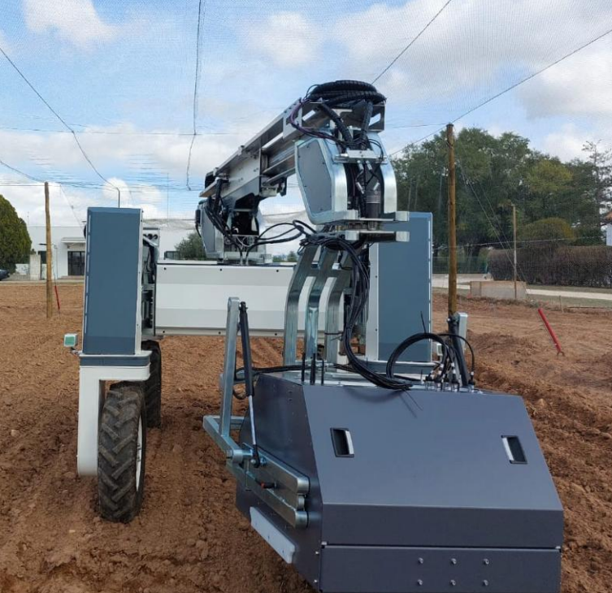
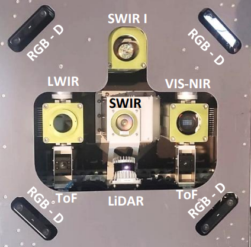
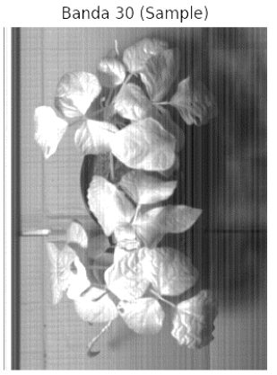
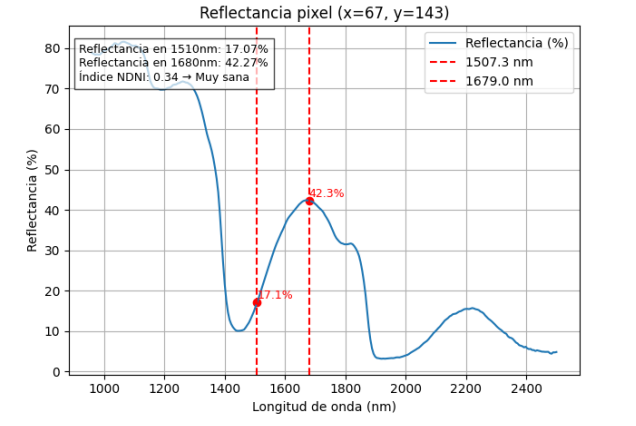
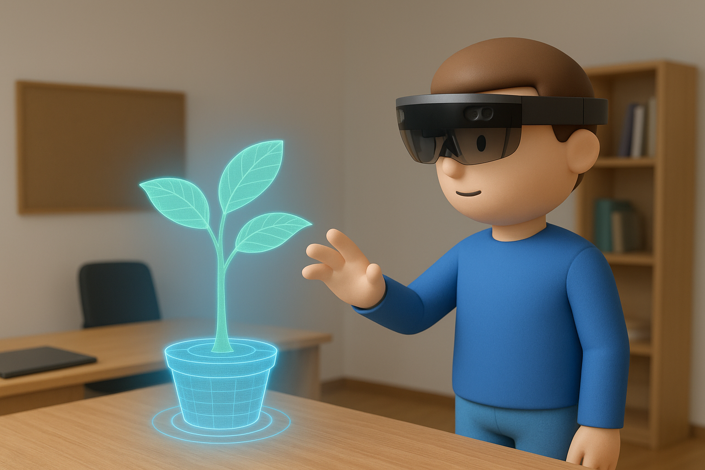
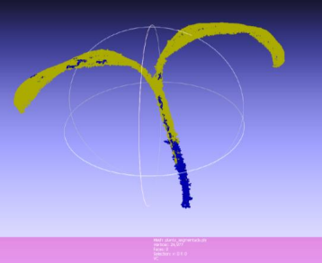
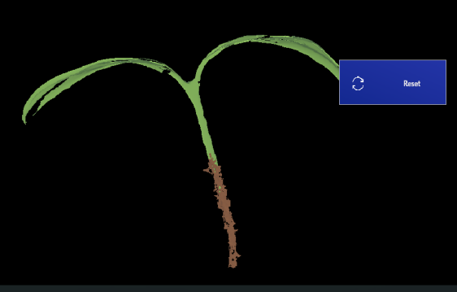

<html lang="es">
 <head>
  <meta charset="utf-8"/>
  <title>
   Portfolio
  </title>
 </head>
 <body>
  <html lang="es">
   <head>
    <meta charset="utf-8">
     <meta content="width=device-width, initial-scale=1.0" name="viewport"/>
     <title>
      Andrea Clemente-Ureña - Portfolio
     </title>
     
    </meta>
   </head>
   <body>
    <button id="language-toggle" onclick="toggleLanguage()">
     English
    </button>
    <header>
     <h1>
      
       👩‍🔬 Andrea Clemente-Ureña
      
      
       👩‍🔬 Andrea Clemente-Ureña
      
     </h1>
     

      
       Aquí comparto mi trayectoria en
       <strong>
        biología
       </strong>
       ,
       <strong>
        bioinformática
       </strong>
       y en el desarrollo de sistemas de
       <strong>
        fenotipado de alto rendimiento
       </strong>
       mediante
       <strong>
        robótica
       </strong>
       e
       <strong>
        inteligencia artificial
       </strong>
       , con énfasis en
       <strong>
        visión computacional 3D
       </strong>
       .
      
      
       I share my background in
       <strong>
        biology
       </strong>
       ,
       <strong>
        bioinformatics
       </strong>
       , and the development of
       <strong>
        high-throughput phenotyping
       </strong>
       systems using
       <strong>
        robotics
       </strong>
       and
       <strong>
        artificial intelligence
       </strong>
       , with a focus on
       <strong>
        3D computer vision
       </strong>
       .
      
     

     

      

       <strong>
        Investigadora predoctoral
       </strong>
       en la
       <strong>
        Universidad Politécnica de Madrid (UPM)
       </strong>
       y el
       <strong>
        Centro de Recursos Fitogenéticos (CRF)
       </strong>
       del
       <strong>
        Instituto Nacional de Investigación y Tecnología Agraria y Alimentaria (INIA)
       </strong>
       , parte del
       <strong>
        Consejo Superior de Investigaciones Científicas (CSIC)
       </strong>
       .
      

      

       Proyecto: Transformación digital de las actividades de conservación y mejora vegetal mediante fenotipado de alto rendimiento (HTP).
      

     

     

      

       <strong>
        PhD researcher
       </strong>
       at the
       <strong>
        Technical University of Madrid (UPM)
       </strong>
       and the
       <strong>
        Center for Plant Genetic Resources (CRF)
       </strong>
       at the
       <strong>
        National Institute for Agricultural and Food Research and Technology (INIA)
       </strong>
       , which is part of the
       <strong>
        Spanish National Research Council (CSIC)
       </strong>
       .
      

      

       Project: Digital transformation of plant genetic resource conservation and crop improvement activities through high-throughput phenotyping (HTP).
      

     

    </header>
    <section class="direct-section" id="bienvenida">
     <h2 class="section-title">
      
       ¡Bienvenid@ a mi portfolio!
      
      
       Welcome to my portfolio!
      
     </h2>
     
     <!-- Español -->
     

      

       Actualmente desarrollo herramientas avanzadas para el
       <strong>
        fenotipado de alto rendimiento (HTP)
       </strong>
       aplicado a
       <strong>
        cultivos
       </strong>
       y a la
       <strong>
        caracterización estructural de plantas
       </strong>
       , utilizando
       <strong>
        Deep Learning
       </strong>
       y
       <strong>
        análisis computacional de rasgos fenotípicos
       </strong>
       .
      

      

       <strong>
        ¡Haz clic en las imágenes para ver mis proyectos!
       </strong>
      

     

     <!-- Inglés -->
     

      

       I currently develop advanced tools for
       <strong>
        high-throughput phenotyping (HTP)
       </strong>
       applied to
       <strong>
        crop analysis
       </strong>
       and
       <strong>
        plant structural characterization
       </strong>
       , using
       <strong>
        Deep Learning
       </strong>
       and
       <strong>
        computational analysis of phenotypic traits
       </strong>
       .
      

      

       <strong>
        Click on the images to explore my projects!
       </strong>
      

     

     

      <a class="lang-es" href="#autorreflexion-section">
       🧠 Leer sobre mi autorreflexión
      </a>
      <a class="lang-en" href="#autorreflexion-section">
       🧠 Read about my self-reflection
      </a>
     

    </section>
    <section class="direct-section" style="background: linear-gradient(145deg, #ffffff 0%, #f0f4f3 100%); border: 1px solid #a5d6a7; padding: 2rem; border-radius: 10px; box-shadow: 0 2px 10px rgba(0,0,0,0.1); margin: 2rem 0;">
     <nav class="nav-flex" style="display: flex; flex-wrap: wrap; justify-content: center; gap: 1rem; max-width: 900px; margin: 0 auto;">
      <a href="#primer-contacto-section" style="flex: 1 1 auto; min-width: 140px; text-align: center; padding: 0.6rem 1rem; white-space: nowrap; text-decoration: none; color: #1b5e20; font-weight: bold; border: 1px solid #ccc; border-radius: 6px; transition: background-color 0.3s, box-shadow 0.3s;">
       
        Mi primer contacto con la investigación
       
       
        My initial experience with research
       
      </a>
      <a href="#proyectos-section" style="flex: 1 1 auto; min-width: 140px; text-align: center; padding: 0.6rem 1rem; white-space: nowrap; text-decoration: none; color: #1b5e20; font-weight: bold; border: 1px solid #ccc; border-radius: 6px; transition: background-color 0.3s, box-shadow 0.3s;">
       
        Proyectos destacados
       
       
        Featured Projects
       
      </a>
      <a href="#formacion-section" style="flex: 1 1 auto; min-width: 140px; text-align: center; padding: 0.6rem 1rem; white-space: nowrap; text-decoration: none; color: #1b5e20; font-weight: bold; border: 1px solid #ccc; border-radius: 6px; transition: background-color 0.3s, box-shadow 0.3s;">
       
        Formación académica
       
       
        Academic Education
       
      </a>
      <a href="#tecnologias-section" style="flex: 1 1 auto; min-width: 140px; text-align: center; padding: 0.6rem 1rem; white-space: nowrap; text-decoration: none; color: #1b5e20; font-weight: bold; border: 1px solid #ccc; border-radius: 6px; transition: background-color 0.3s, box-shadow 0.3s;">
       
        Tecnologías y herramientas
       
       
        Technologies &amp; Tools
       
      </a>
      <a href="#experiencia-section" style="flex: 1 1 auto; min-width: 140px; text-align: center; padding: 0.6rem 1rem; white-space: nowrap; text-decoration: none; color: #1b5e20; font-weight: bold; border: 1px solid #ccc; border-radius: 6px; transition: background-color 0.3s, box-shadow 0.3s;">
       
        Experiencia Profesional
       
       
        Professional Experience
       
      </a>
      <a href="#idiomas-section" style="flex: 1 1 auto; min-width: 140px; text-align: center; padding: 0.6rem 1rem; white-space: nowrap; text-decoration: none; color: #1b5e20; font-weight: bold; border: 1px solid #ccc; border-radius: 6px; transition: background-color 0.3s, box-shadow 0.3s;">
       
        Idiomas
       
       
        Languages
       
      </a>
      <a href="#cursos-section" style="flex: 1 1 auto; min-width: 140px; text-align: center; padding: 0.6rem 1rem; white-space: nowrap; text-decoration: none; color: #1b5e20; font-weight: bold; border: 1px solid #ccc; border-radius: 6px; transition: background-color 0.3s, box-shadow 0.3s;">
       
        Cursos
       
       
        Courses
       
      </a>
      <a href="#seminarios-section" style="flex: 1 1 auto; min-width: 140px; text-align: center; padding: 0.6rem 1rem; white-space: nowrap; text-decoration: none; color: #1b5e20; font-weight: bold; border: 1px solid #ccc; border-radius: 6px; transition: background-color 0.3s, box-shadow 0.3s;">
       
        Seminarios y jornadas
       
       
        Seminars and Workshops
       
      </a>
      <a href="#contacto-section" style="flex: 1 1 auto; min-width: 140px; text-align: center; padding: 0.6rem 1rem; white-space: nowrap; text-decoration: none; color: #1b5e20; font-weight: bold; border: 1px solid #ccc; border-radius: 6px; transition: background-color 0.3s, box-shadow 0.3s;">
       
        Contacto
       
       
        Contact
       
      </a>
     </nav>
    </section>
    <!-- Sección: Mi primer contacto con la investigación -->
    <section class="direct-section" id="primer-contacto-section">
     <h2 class="section-title">
      
       💡 Mi primer contacto con la investigación
      
      
       💡 My first encounter with research
      
     </h2>
     

      
       Mi primer contacto con la investigación fue en 1º de Bachillerato en el
       <strong>
        IES Alameda de Osuna
       </strong>
       , donde desarrollé un proyecto sobre la
       <em>
        síntesis de bioplásticos a partir de leche de vaca
       </em>
       en las asignaturas de Biología y Técnicas Experimentales en Ciencias. Ese mismo año participé en el
       <strong>
        Finde Científico
       </strong>
       con el proyecto
       <em>
        “De la magia del arco iris al modelo de Bohr”
       </em>
       , formando parte de un equipo dedicado a la divulgación científica mediante experimentos de química visual.
        
       El Finde Científico es una feria organizada por la
       <strong>
        Fundación Española para la Ciencia y la Tecnología (FECYT)
       </strong>
       y el
       <strong>
        Museo Nacional de Ciencia y Tecnología (MUNCYT)
       </strong>
       , con la colaboración de
       <strong>
        Obra Social “la Caixa”
       </strong>
       .
      
      
       My first experience with research took place during the first year of Bachillerato (upper secundary education) at
       <strong>
        IES Alameda de Osuna
       </strong>
       , where I developed a project on the
       <em>
        synthesis of bioplastics from cow’s milk
       </em>
       in Biology and Experimental Science Techniques. That same year, I took part in the
       <strong>
        Finde Científico
       </strong>
       with the project
       <em>
        “De la magia del arco iris al modelo de Bohr”
       </em>
       , as part of a team focused on science outreach through visual chemistry experiments.
        
       The Finde Científico is a science fair organized by the
       <strong>
        Spanish Foundation for Science and Technology (FECYT)
       </strong>
       and the
       <strong>
        National Museum of Science and Technology (MUNCYT)
       </strong>
       , with support from
       <strong>
        Obra Social “la Caixa”
       </strong>
       .
      
     

     

      <figure style="max-width: 300px; margin: 0; text-align: center;">
       
        <figcaption style="font-size: 0.8rem; color: #555; margin-top: 0.3rem;">
         
          Ejemplo de imagen de síntesis de bioplásticos
         
         
          Example image for bioplastics Synthesis
         
        </figcaption>
      </figure>
      <figure style="max-width: 300px; margin: 0; text-align: center;">
       
       <figcaption style="font-size: 0.8rem; color: #555; margin-top: 0.3rem;">
        
         Ejemplo de lo que hice en el Finde Científico
        
        
         Example of what I did at the "Finde Científico"
        
       </figcaption>
      </figure>
     

     
    </section>
    <!-- Sección: Proyectos destacados -->
    <section class="direct-section" id="proyectos-section">
     <h2 class="section-title">
      
       🚀 Proyectos destacados
      
      
       🚀 Featured Projects
      
     </h2>
     <!-- Proyecto 1 -->
     

      

       
        Fenotipado de alto rendimiento
       
       
        High-throughput phenotyping
       
      

      

       
      

      

       

        

         Mi tesis doctoral se centra en el desarrollo de un sistema de
         <strong>
          fenotipado vegetal de alto rendimiento
         </strong>
         mediante robótica autónoma,
         <strong>
          visión computacional 3D
         </strong>
         e
         <strong>
          imagen hiperespectral
         </strong>
         . Trabajo con
         <strong>
          datos obtenidos de cámaras RGB e hiperespectrales
         </strong>
         (VIS–NIR y SWIR) integrados en plataformas robóticas para entrenar modelos de inteligencia artificial orientados a
         <strong>
          reconstrucción 3D
         </strong>
         ,
         <strong>
          segmentación de estructuras vegetales
         </strong>
         y
         <strong>
          detección temprana de estrés
         </strong>
         . Además, estoy trabajando en la fusión entre datos espectrales y geométricos para mejorar la caracterización del estado fisiológico de las plantas.
        

         
        <!-- Cabezal sensorizado -->
        

         
         

          La plataforma robótica integra un
          <strong>
           cabezal sensorizado
          </strong>
          con cámaras RGB-D, sensores hiperespectrales (VIS–NIR y SWIR), cámara térmica (LWIR), sensor de profundidad (ToF), nubes de puntos 3D (LiDAR) y unidad inercial. Esta combinación permite capturar simultáneamente información
          <strong>
           geométrica, radiométrica y espectral
          </strong>
          para caracterizar el estado de la planta con alta precisión.
         

        

        <!-- Imagen SWIR de Vigna -->
        

         
         

          Ejemplo de captura en el rango
          <strong>
           SWIR (950–2500 nm)
          </strong>
          sobre plantas de
          <em>
           Vigna unguiculata
          </em>
          . En estas longitudes de onda se pueden observar varios parámetros, especialmente relacionadas con contenido hídrico y propiedades internas del tejido.
         

        

        <!-- Curva de reflectancia -->
        

         
         

          Ejemplo de
          <strong>
           curva de reflectancia
          </strong>
          obtenida a partir de un píxel representativo de la planta. La reflectancia aumenta en el
          <strong>
           NIR
          </strong>
          debido a la estructura interna del mesófilo, mientras que en el
          <strong>
           SWIR
          </strong>
          aparecen variaciones asociadas al contenido de agua. Estas reflectancias permiten calcular índices vegetativos e identificar indicadores tempranos de estrés.
         

        

         
        

         Colaboro activamente con el
         <strong>
          Centro de Automática y Robótica (CAR, CSIC-UPM)
         </strong>
         y la empresa tecnológica
         <strong>
          INYCOM
         </strong>
         en el marco del contrato predoctoral
         <strong>
          MOMENTUM MMT24-PTI AGROFOR
         </strong>
         .
        

        

         En 2025 participé en la escuela de verano de inteligencia artificial organizada por
         <strong>
          AIHUB-CSIC
         </strong>
         en Zaragoza, donde presenté el póster titulado
         <em>
          “IA y visión 3D hiperespectral para fenotipado de alto rendimiento”
         </em>
         .  
    DOI:
         <a href="http://dx.doi.org/10.13140/RG.2.2.27077.77289" target="_blank">
          10.13140/RG.2.2.27077.77289
         </a>
         .
        

       

       

        

         My PhD research focuses on the development of a
         <strong>
          high-throughput plant phenotyping
         </strong>
         system using autonomous robotics,
         <strong>
          3D computer vision
         </strong>
         , and
         <strong>
          hyperspectral imaging
         </strong>
         . I work with
         <strong>
          RGB and hyperspectral data
         </strong>
         (VIS–NIR and SWIR) integrated into robotic platforms to train AI models for
         <strong>
          3D reconstruction
         </strong>
         ,
         <strong>
          plant structure segmentation
         </strong>
         , and
         <strong>
          early stress detection
         </strong>
         . I am also working on spectral–geometric data fusion to improve the characterization of plant physiological status.
        

         
        <!-- Sensor head -->
        

         
         

          The robotic platform integrates a
          <strong>
           multimodal sensor head
          </strong>
          combining RGB-D cameras, hyperspectral sensors (VIS–NIR and SWIR), a thermal camera (LWIR), depth sensing (ToF), 3D point clouds (LiDAR), and an inertial measurement unit. This configuration enables simultaneous acquisition of
          <strong>
           geometric, radiometric, and spectral
          </strong>
          information for accurate plant characterization.
         

        

        <!-- SWIR image of Vigna -->
        

         
         

          Example of a capture in the
          <strong>
           SWIR range (950–2500 nm)
          </strong>
          of
          <em>
           Vigna unguiculata
          </em>
          plants. TIn these wavelengths, several parameters can be observed, especially those related to water content and internal tissue properties.
         

        

        <!-- Reflectance curve -->
        

         
         

          Example of a
          <strong>
           reflectance curve
          </strong>
          extracted from a representative plant pixel. Reflectance increases in the
          <strong>
           NIR
          </strong>
          due to the internal structure of the mesophyll, while characteristic variations appear in the
          <strong>
           SWIR
          </strong>
          region associated with water content. These reflectances are essential for computing vegetation indices and identifying early stress indicators.
         

        

         
        

         I actively collaborate with the
         <strong>
          Centre for Automation and Robotics (CAR, CSIC-UPM)
         </strong>
         and the tech company
         <strong>
          INYCOM
         </strong>
         , within the framework of the
         <strong>
          MOMENTUM MMT24-PTI AGROFOR
         </strong>
         predoctoral programme.
        

        

         In 2025, I took part in the artificial intelligence summer school organized by
         <strong>
          AIHUB-CSIC
         </strong>
         in Zaragoza, where I presented the poster titled
         <em>
          “AI and 3D Hyperspectral Vision for High-Throughput Phenotyping”
         </em>
         .  
    DOI:
         <a href="http://dx.doi.org/10.13140/RG.2.2.27077.77289" target="_blank">
          10.13140/RG.2.2.27077.77289
         </a>
         .
        

       

       <!-- Póster interactivo -->
       

        <!-- Imagen -->
        

         
        

        <!-- Pie de imagen -->
        

         
          Póster:
          <em>
           IA y visión 3D hiperespectral para fenotipado de alto rendimiento
          </em>
          . Pulsa sobre la imagen para ampliar.
         
          
         
          Poster:
          <em>
           AI and 3D Hyperspectral Vision for High-Throughput Phenotyping
          </em>
          . Click the image to enlarge.
         
        

        <!-- Botón de despliegue -->
        

         <!-- Español -->
         <button class="lang-es" onclick="togglePosterText()" style="padding: 0.5rem 1rem; font-size: 1rem; cursor: pointer;">
          Texto del póster (haz clic para ver)
         </button>
         <!-- Inglés -->
         <button class="lang-en" onclick="togglePosterText()" style="padding: 0.5rem 1rem; font-size: 1rem; cursor: pointer;">
          Poster text (click to view)
         </button>
        

        <!-- Texto del póster oculto por defecto -->
        

         <!-- TEXTO COMPLETO EN ESPAÑOL -->
         
          <strong>
           Texto del póster:
          </strong>
          <em>
           INTRODUCCIÓN  
El fenotipado vegetal de alto rendimiento es clave para la mejora genética y la conservación de recursos fitogenéticos. Sin embargo, la mayoría de los sistemas avanzados disponibles:

Solo funcionan en condiciones controladas.  
Obtienen datos limitados (solo información 3D, solo información hiperespectral, etc.).
           <strong>
            ¿Y si un solo robot pudiera hacerlo todo?
           </strong>
           - Autonomía (GNSS-RTK).  
- Trabajo en campo.  
- Sensores 3D, cámaras RGB e hiperespectrales. Con 173 canales.

Procesado mediante Inteligencia Artificial de imágenes 3D e hiperespectrales para reconstrucción, segmentación y posterior análisis de cultivos.

OBJETIVO  
Desarrollar y validar una plataforma robótica autónoma con sensores múltiples para:

- Captar datos 3D (nubes de puntos) e información hiperespectral.  
- Reconstruir modelos 3D detallados integrando la información hiperespectral en cada punto.  
- Identificar estructuras vegetales (hojas, tallo, inflorescencias, etc.) y detectar signos de estrés.  
Todo ello sin contacto, sin destrucción, directamente en parcelas.

METODOLOGÍA  
Plataforma robótica en campo  
Robot autónomo desarrollado por INYCOM, diseñado para desplazarse por parcelas y capturar datos, financiado por el componente 17.i2 del plan de recuperación, transformación y resiliencia perteneciente a los fondos de Next Generación UE.  

Sensores integrados de última generación:

Captura de imágenes 3D  
La combinación de todos los sensores permite generar nubes de puntos detalladas para cada planta, integrando forma, textura y contenido hiperespectral en cada punto.

Procesamiento y análisis con IA  

- Reconstrucción de nubes de puntos 3D con información hiperespectral.  
- Segmentación 2D y 3D de estructuras vegetales.  
- Identificación y cálculo de parámetros morfológicos.  
- Cálculo de índices de vegetación para monitorizar estrés.

ANÁLISIS  
- SfM + NeRF y variantes (reconstrucción 3D neuronal a partir de geometría previa).  
- Mask R-CNN, SAM (segmentación en 2D para proyectar sobre el 3D).  
- PointNet, PointGroup, Mask3D, SAM 3D (segmentación en nubes de puntos 3D).

RESULTADOS ESPERADOS  
Se realizarán pruebas en parcelas experimentales para comprobar:

- Calidad y detalle de la reconstrucción 3D integrada con datos hiperespectrales.  
- Precisión en la identificación automática de estructuras vegetales.  
- Fiabilidad en la medición de parámetros morfológicos.  
- Capacidad para detectar estrés mediante índices de vegetación.

CONCLUSIÓN  
El robot está desarrollado y es funcional.  
Actualmente está en fase de integración y validación en campo. Se cuenta con un contrato predoctoral MOMENTUM MMT24-PTI AGROFOR para implementarlo.

Enfoque innovador y escalable para el fenotipado vegetal de alto rendimiento de nueva generación.

Este sistema estará disponible como servicio científico-técnico para usuarios de PTIAGRO4FOOD para determinaciones en sus propias explotaciones agrícolas.
          </em>
         
          
          
         <!-- TEXTO COMPLETO EN INGLÉS -->
         
          <strong>
           Poster text:
          </strong>
          <em>
           INTRODUCTION  
High-throughput plant phenotyping is key to genetic improvement and the conservation of plant genetic resources. However, most advanced systems currently available:

Only work under controlled conditions.  
Gather limited data (only 3D or only hyperspectral info, etc.).
           <strong>
            What if a single robot could do it all?
           </strong>
           - Autonomy (GNSS-RTK).  
- Field operation.  
- 3D sensors, RGB and hyperspectral cameras with 173 channels.

Processing 3D and hyperspectral images using artificial intelligence for crop reconstruction, segmentation, and analysis.

OBJECTIVE  
Develop and validate an autonomous robotic platform with multiple sensors to:

- Capture 3D data (point clouds) and hyperspectral information.  
- Reconstruct detailed 3D models integrating hyperspectral data per point.  
- Identify plant structures (leaves, stem, inflorescences, etc.) and detect signs of stress.  
All non-invasively and directly in the field.

METHODOLOGY  
Robotic platform in the field  
Autonomous robot developed by INYCOM, designed to move across plots and capture data. Funded by component 17.i2, Recovery, Transformation, and Resilience Plan (Next Generation EU funds).  

Integrated state-of-the-art sensors:

3D image capture  
Sensor fusion allows generating detailed point clouds for each plant, integrating shape, texture, and hyperspectral content per point.

Processing and analysis with AI  

- Reconstruction of 3D point clouds with hyperspectral data.  
- 2D and 3D segmentation of plant structures.  
- Identification and calculation of morphological parameters.  
- Calculation of vegetation indices to monitor stress.

ANALYSIS  
- SfM + NeRF and variants (neural 3D reconstruction from prior geometry).  
- Mask R-CNN, SAM (2D segmentation projected onto 3D).  
- PointNet, PointGroup, Mask3D, SAM 3D (segmentation in 3D point clouds).

EXPECTED RESULTS  
Field tests will be carried out in experimental plots to assess:

- Quality and detail of 3D reconstruction integrated with hyperspectral data.  
- Accuracy in automatic identification of plant structures.  
- Reliability in measuring morphological parameters.  
- Capability to detect stress through vegetation indices.

CONCLUSION  
The robot is developed and functional.  
It is currently in the integration and field validation phase, supported by a predoctoral contract (MOMENTUM MMT24-PTI AGROFOR) for implementation.

An innovative and scalable approach to next-generation high-throughput plant phenotyping.

This system will be available as a scientific-technical service for PTIAGRO4FOOD users for use in their own agricultural operations.
          </em>
         
        

       

       <!-- Script para desplegar texto -->
       
      

     

     <!-- Proyecto 2 -->
     

      

       
        Bioinformática y análisis ómico
       
       
        Bioinformatics and omics analysis
       
      

      

       
      

      

       

        
         He adquirido experiencia en el análisis computacional de datos ómicos, aplicando técnicas de bioinformática, estadística y programación con R y Python para interpretar información transcriptómica, genómica y epigenética. Utilizo métodos como análisis de expresión diferencial, clustering, enriquecimiento funcional y visualización de datos.
        
       

       

        
         En mi Trabajo Final de Máster, realicé un estudio sobre la identificación y caracterización de fragmentos derivados de ARN de transferencia (tRFs) sobreexpresados en un modelo murino de la enfermedad de Huntington. Los tRFs son pequeñas moléculas de ARN emergentes con funciones regulatorias potenciales. Utilicé datasets reales de RNA-seq proporcionados por el grupo de investigación liderado por Eulàlia Martí y con la tutoría de la Dra. Geòrgia Escaramís (Universitat de Barcelona). Analicé datos transcriptómicos de tejido cerebral de ratón, aplicando pipelines bioinformáticos para detectar tRFs diferencialmente expresados, inferir su posible función y vincularlos con rutas biológicas relevantes en el contexto de Huntington. Este trabajo aporta información sobre posibles biomarcadores o mecanismos moleculares implicados en la progresión de la enfermedad.
          
         <strong>
          TFM:
         </strong>
         <em>
          Identificación y caracterización de los tRFs sobreexpresados en la enfermedad de Huntington mediante herramientas bioinformáticas
         </em>
         . DOI:
         <a href="https://doi.org/10.13140/RG.2.2.33680.32001" target="_blank">
          10.13140/RG.2.2.33680.32001
         </a>
        
       

       

        
         I have developed experience in computational omics data analysis, applying bioinformatics, statistics, and programming in R and Python to interpret transcriptomic, genomic, and epigenetic data. I work with differential expression analysis, clustering, functional enrichment, and data visualization.
        
       

       

        
         For my Master's Thesis, I conducted a study focused on identifying and characterizing transfer RNA-derived fragments (tRFs) overexpressed in a mouse model of Huntington’s disease. tRFs are small emerging RNA molecules with potential regulatory roles. I used real RNA-seq datasets provided by the research group led by Eulàlia Martí and supervised by Dr. Geòrgia Escaramís (University of Barcelona). I analyzed transcriptomic data from mouse brain tissue using bioinformatics pipelines to detect differentially expressed tRFs, assess their potential functions, and explore their involvement in biological pathways associated with Huntington’s disease. This work contributes to the understanding of tRFs as potential biomarkers or regulators of disease progression.
          
         <strong>
          Master's Thesis:
         </strong>
         <em>
          Identification and characterization of overexpressed tRFs in Huntington's disease using bioinformatics tools
         </em>
         . DOI:
         <a href="https://doi.org/10.13140/RG.2.2.33680.32001" target="_blank">
          10.13140/RG.2.2.33680.32001
         </a>
        
       

      

     

     <!-- Proyecto 3 -->
     

      

       
        Genética molecular y citología
       
       
        Molecular genetics and cytology
       
      

      

       
      

      

       <!-- Versión en español -->
       

        

         Cuento con formación sólida en genética molecular, citología y biología celular, incluyendo técnicas avanzadas de laboratorio, embriología y análisis genético en organismos modelo y no modelo. He trabajado con herramientas bioinformáticas y bases de datos genómicas para estudiar la organización y evolución de genes.
        

        

         En mi Trabajo de Fin de Grado realicé una caracterización estructural exhaustiva de los genes que codifican proteínas de la subunidad mayor del ribosoma en el protista parásito
         <em>
          Leishmania
         </em>
         . Este trabajo se centró en analizar la organización génica, intrones, regiones UTR y conservación entre especies, empleando análisis de secuencias, anotaciones funcionales y herramientas como MEME para el estudio de motivos conservados.
        

        

         El estudio se llevó a cabo bajo la dirección del Dr. José María Requena en el CBMSO (Centro de Biología Molecular Severo Ochoa, CSIC-UAM), y contribuyó a la comprensión funcional y evolutiva de la maquinaria ribosomal en kinetoplástidos, parásitos de gran relevancia biomédica.
        

        

         <strong>
          TFG:
         </strong>
         <em>
          Caracterización estructural de los genes codificantes de proteínas de la subunidad mayor del ribosoma en el protista Leishmania
         </em>
         . DOI:
         <a href="https://doi.org/10.13140/RG.2.2.10192.21767" target="_blank">
          10.13140/RG.2.2.10192.21767
         </a>
        

        

         Participación mencionada en el
         <a href="https://www.cbm.uam.es/wp-content/uploads/2024/07/CBM-Scientific-Report-2021-2022.pdf" target="_blank">
          Informe Científico del CBMSO-CSIC 2021–2022
         </a>
         .
        

       

       <!-- English version -->
       

        

         I have a strong background in molecular genetics, cytology, and cell biology, including advanced laboratory techniques, embryology, and genetic analysis in both model and non-model organisms. I have used bioinformatics tools and genomic databases to study gene structure and evolution.
        

        

         For my Bachelor's Thesis, I performed a comprehensive structural characterization of genes encoding large ribosomal subunit proteins in the parasitic protist
         <em>
          Leishmania
         </em>
         . The work focused on gene organization, introns, UTR regions, and interspecies conservation, employing sequence analysis, functional annotation, and tools such as MEME for conserved motif discovery.
        

        

         This study was conducted under the supervision of Dr. José María Requena at CBMSO (Centro de Biología Molecular Severo Ochoa, CSIC-UAM), contributing to the functional and evolutionary understanding of ribosomal machinery in kinetoplastid parasites, which hold significant biomedical relevance.
        

        

         <strong>
          Bachelor's Thesis:
         </strong>
         <em>
          Structural characterization of genes encoding large ribosomal subunit proteins in the protist Leishmania
         </em>
         . DOI:
         <a href="https://doi.org/10.13140/RG.2.2.10192.21767" target="_blank">
          10.13140/RG.2.2.10192.21767
         </a>
        

        

         Mentioned in the
         <a href="https://www.cbm.uam.es/wp-content/uploads/2024/07/CBM-Scientific-Report-2021-2022.pdf" target="_blank">
          CBMSO-CSIC 2021–2022 Scientific Report
         </a>
         .
        

       

      

     

     <!-- Proyecto 4 -->
     

      

       
        Histología e inmunohistoquímica
       
       
        Histology and immunohistochemistry
       
      

      

       
      

      

       

        
         Detección Inmunohistoquímica de BRCA en Cáncer de Mama
          
          
         En este proyecto llevado a cabo en el hospital HM de Sanchinarro, realicé la detección inmunohistoquímica de los genes BRCA1 y BRCA2 en muestras de tejido mamario con sospecha de cáncer. Utilicé anticuerpos específicos para BRCA y otros marcadores como HER2, Ki-67, ER y PR. Tras aplicar los anticuerpos, se visualizó la expresión de BRCA en las células mediante un marcador cromogénico (DAB), que generó una coloración marrón característica en las células positivas.
          
          
         Este proyecto me permitió desarrollar habilidades en técnicas de inmunohistoquímica, microscopía y la interpretación de marcadores tumorales en la investigación del cáncer de mama.
        
        
         Immunohistochemical Detection of BRCA in Breast Cancer
          
          
         In this project carried out at the HM Hospital in Sanchinarro, I performed the immunohistochemical detection of BRCA1 and BRCA2 genes in breast tissue samples with suspected cancer. I used specific antibodies for BRCA, as well as other markers such as HER2, Ki-67, ER, and PR. After applying the antibodies, the expression of BRCA in the cells was visualized through a chromogenic marker (DAB), which produced a characteristic brown staining in the positive cells.
          
          
         This project allowed me to develop skills in immunohistochemical techniques, microscopy, and tumor marker interpretation in breast cancer research.
        
       

      

     

     <!-- Proyecto 5 -->
     

      

       
        Tecnologías inmersivas
       
       
        Immersive technologies
       
      

      

       
      

      

       

        
         Desarrollo aplicaciones inmersivas para agricultura de precisión en colaboración con el
         <strong>
          Centro de Automática y Robótica (CAR-CSIC-UPM)
         </strong>
         , utilizando
         <strong>
          Microsoft HoloLens 2
         </strong>
         ,
         <strong>
          Unity
         </strong>
         ,
         <strong>
          Python
         </strong>
         y
         <strong>
          C#
         </strong>
         .

  Actualmente trabajo en un
         <strong>
          modelo 3D interactivo de planta
         </strong>
         generado a partir de
         <strong>
          nubes de puntos reales
         </strong>
         . En las HoloLens 2, el usuario puede seleccionar zonas específicas de la planta mediante gestos manuales: al seleccionar un órgano (hojas, tallo), el resto desaparece y aparece un
         <strong>
          cartel informativo
         </strong>
         identificando ese elemento. Esto permite explorar la estructura vegetal de forma intuitiva y didáctica.

  El sistema está implementado con
         <strong>
          MRTK
         </strong>
         y
         <strong>
          XR Interaction Toolkit
         </strong>
         , utilizando animaciones, lógica de visibilidad y gestión de interacciones. En fases futuras se integrará
         <strong>
          inteligencia artificial para la integración de la información hiperespectral en el objeto 3D
         </strong>
         .
        
        
         I develop immersive applications for precision agriculture in collaboration with the
         <strong>
          Center for Automation and Robotics (CAR-CSIC-UPM)
         </strong>
         , using
         <strong>
          Microsoft HoloLens 2
         </strong>
         ,
         <strong>
          Unity
         </strong>
         ,
         <strong>
          Python
         </strong>
         and
         <strong>
          C#
         </strong>
         .

  I am currently working on an
         <strong>
          interactive 3D plant model
         </strong>
         generated from
         <strong>
          real point clouds
         </strong>
         . In HoloLens 2, users can select specific plant regions using hand gestures: when an organ (leaves, stems…) is selected, the remaining parts disappear and an
         <strong>
          informative label
         </strong>
         appears. This enables intuitive and educational exploration of plant structure.

  The system is built using
         <strong>
          MRTK
         </strong>
         and
         <strong>
          XR Interaction Toolkit
         </strong>
         , including animations, visibility control and interaction logic. In future phases,
         <strong>
          artificial intelligence will be integrated for incorporating hyperspectral information into the 3D object
         </strong>
         .
        
        

         <!-- Contenedor de imágenes -->
         

          <!-- Nube de puntos -->
          <figure style="width: 48%; margin: 0;">
           
           <figcaption style="text-align: center; font-size: 0.9rem; margin-top: 0.4rem; color: #555;">
            
             Nube de puntos original
            
            
             Original point cloud
            
           </figcaption>
          </figure>
          <!-- Planta en HoloLens (Unity Simulator) -->
          <figure style="width: 48%; margin: 0;">
           
           <figcaption style="text-align: center; font-size: 0.9rem; margin-top: 0.4rem; color: #555;">
            
             Modelo 3D dentro del simulador de Unity
            
            
             3D model inside Unity simulator
            
           </figcaption>
          </figure>
         

         

          <video controls="" src="planta1.mp4" style="width: 90%; max-width: 1200px; border-radius: 8px;">
          </video>
          

           
            Interacción en tiempo real PRUE
           
           
            Real-time interaction
           
          

         

        

       

      

     

    </section>
    <!-- Sección: Formación académica -->
    <section class="direct-section" id="formacion-section">
     <h2 class="section-title">
      
       🎓 Formación académica
      
      
       🎓 Academic Education
      
     </h2>
     <ul>
      <li>
       
        📘
        <strong>
         Doctorado en Automática y Robótica
        </strong>
        (2024 - actualidad)
         
        Universidad Politécnica de Madrid – INIA-CSIC
       
       
        📘
        <strong>
         PhD in Automation and Robotics
        </strong>
        (2024 - Present)
         
        Polytechnic University of Madrid – INIA-CSIC
       
      </li>
      <li>
       
        📊
        <strong>
         Máster en Bioinformática y Bioestadística
        </strong>
        (2022 - 2024)
         
        Universitat Oberta de Catalunya / Universitat de Barcelona
       
       
        📊
        <strong>
         Master in Bioinformatics and Biostatistics
        </strong>
        (2022 - 2024)
         
        Open University of Catalonia / University of Barcelona
       
      </li>
      <li>
       
        🧬
        <strong>
         Grado en Biología
        </strong>
        (2016 - 2021)
         
        Universidad Autónoma de Madrid
       
       
        🧬
        <strong>
         Bachelor in Biology
        </strong>
        (2016 - 2021)
         
        Autonomous University of Madrid
       
      </li>
      <li>
       
        🔬
        <strong>
         Técnico Superior en Anatomía Patológica y Citología
        </strong>
        (2014 - 2016)
         
        CESUR II
       
       
        🔬
        <strong>
         Higher Technician in Pathological Anatomy and Cytology
        </strong>
        (2014 - 2016)
         
        CESUR II
       
      </li>
     </ul>
    </section>
    <!-- Sección: Tecnologías y herramientas -->
    <section class="direct-section" id="tecnologias-section">
     <h2 class="section-title">
      
       🛠️ Tecnologías y herramientas
      
      
       🛠️ Technologies and Tools
      
     </h2>
     <table>
      <tr>
       <td>
        <strong>
         
          Lenguajes
         
         
          Languages
         
        </strong>
       </td>
       <td>
        Python • R • SQL • BASH • HTML/CSS • JavaScript • C#
       </td>
      </tr>
      <tr>
       <td>
        <strong>
         
          Ciencia &amp; Bioinfo
         
         
          Science &amp; Bioinformatics
         
        </strong>
       </td>
       <td>
        Bioconductor • SPSS • Galaxy • Novopath • BLAST • Alineamientos • Análisis genómicos
       </td>
      </tr>
      <tr>
       <td>
        <strong>
         
          IA / Visión
         
         
          AI / Vision
         
        </strong>
       </td>
       <td>
        TensorFlow • PyTorch • Scikit-learn • Keras • OpenCV • Pandas • NumPy • Matplotlib
       </td>
      </tr>
      <tr>
       <td>
        <strong>
         
          Robótica
         
         
          Robotics
         
        </strong>
       </td>
       <td>
        Sensores RGB • Sensores Multiespectrales • Sensores LiDAR/ToF • HoloLens 2
       </td>
      </tr>
      <tr>
       <td>
        <strong>
         
          Entornos
         
         
          Environments
         
        </strong>
       </td>
       <td>
        Linux • VS Code • Unity • GitHub • Office
       </td>
      </tr>
     </table>
    </section>
    <!-- Sección: Experiencia profesional -->
    <section class="direct-section" id="experiencia-section">
     <h2 class="section-title">
      
       📚 Experiencia profesional
      
      
       📚 Professional Experience
      
     </h2>
     <ul>
      <li>
       
        🔬
        <strong>
         Investigadora Predoctoral
        </strong>
        | INIA-CSIC (2024 - actualidad)
         
        Fenotipado automatizado de cultivos con robótica y visión computacional. Diseño experimental y análisis de datos fenotípicos.
       
       
        🔬
        <strong>
         Predoctoral Researcher
        </strong>
        | INIA-CSIC (2024 - Present)
         
        Automated crop phenotyping with robotics and computer vision. Experimental design and phenotypic data analysis.
       
      </li>
      <li>
       
        🧫
        <strong>
         Técnico de Anatomía Patológica
        </strong>
        | HM Hospitales (2016)
         
        Procesamiento y análisis de muestras biológicas y técnicas histológicas.
       
       
        🧫
        <strong>
         Pathological Anatomy Technician
        </strong>
        | HM Hospitales (2016)
         
        Processing and analysis of biological samples and histological techniques.
       
      </li>
      <li>
       
        📞
        <strong>
         Teleoperadora Comercial
        </strong>
        | My Assessor Total (2021)
         
        Primer contacto con el mundo laboral. Aprender cómo funciona el empleo fuera del ámbito científico.
       
       
        📞
        <strong>
         Commercial Operator
        </strong>
        | My Assessor Total (2021)
         
        First contact with the working world. Learning how employment works outside the scientific field.
       
      </li>
     </ul>
    </section>
    <!-- Sección: Idiomas -->
    <section class="direct-section" id="idiomas-section">
     <h2 class="section-title">
      
       🌐 Idiomas
      
      
       🌐 Languages
      
     </h2>
     <ul>
      <li>
       
        Español: Nativo
       
       
        Spanish: Native
       
      </li>
      <li>
       
        Inglés: Nivel C (APTIS - British Council)
       
       
        English: Level C (APTIS - British Council)
       
      </li>
      <li>
       
        Francés: Nivel A2 (DELF)
       
       
        French: Level A2 (DELF)
       
      </li>
      <li>
       
        Alemán: Nivel básico
       
       
        German: Basic level
       
      </li>
      <li>
       
        Catalán: Nivel básico
       
       
        Catalan: Basic level
       
      </li>
     </ul>
    </section>
    <!-- Sección: Cursos -->
    <section class="direct-section" id="cursos-section">
     <h2 class="section-title">
      
       🎓 Cursos
      
      
       🎓 Courses
      
     </h2>
     <ul>
      <li>
       
        📘
        <strong>
         Microcredencial Portfolio Digital
        </strong>
        (75 horas, 2025) – CSIC
       
       
        📘
        <strong>
         Digital Portfolio Microcredential
        </strong>
        (75 hours, 2025) – CSIC
       
      </li>
      <li>
       
        📊
        <strong>
         Statistics for Natural Resources →
         <a href="https://raw.githubusercontent.com/andreaclemente96/AndreaClementeUrena/andreaclemente96-portfolio/EL-ejercicio-de-estadistica-curso.docx" target="_blank">
          Ejercicio final
         </a>
        </strong>
        (30 horas, 2025) – UPM
       
       
        📊
        <strong>
         Statistics for Natural Resources →
         <a href="https://raw.githubusercontent.com/andreaclemente96/AndreaClementeUrena/andreaclemente06-portfolio/EL-ejercicio-de-estadistica-curso.docx" target="_blank">
          Final exercise
         </a>
        </strong>
        (30 hours, 2025) – UPM
       
      </li>
      <li>
       
        🤖
        <strong>
         Inteligencia Artificial y Software Development →
         <a href="https://github.com/andreaclemente96/Courses/blob/main/classification_lab1.ipynb" target="_blank">
          Laboratorios
         </a>
        </strong>
        (13,5 horas, 2025) – IBM y UPM
       
       
        🤖
        <strong>
         Artificial Intelligence and Software Development →
         <a href="https://github.com/andreaclemente96/Courses/blob/main/classification_lab1.ipynb" target="_blank">
          Labs
         </a>
        </strong>
        (13.5 hours, 2025) – IBM &amp; UPM
       
       

        
        
       

      </li>
      <li>
       
        🌐
        <strong>
         Conecta y colabora de forma efectiva en entornos digitales
        </strong>
        (25 horas, 2025) – CSIC
       
       
        🌐
        <strong>
         Connect and Collaborate Effectively in Digital Environments
        </strong>
        (25 hours, 2025) – CSIC
       
      </li>
      <li>
       
        📘
        <strong>
         Fundamentos de la programación: Inteligencia Artificial
        </strong>
        (1h 51min, 2025) – LinkedIn Learning
       
       
        📘
        <strong>
         Programming Foundations: Artificial Intelligence
        </strong>
        (1h 51min, 2025) – LinkedIn Learning
       
      </li>
      <li>
       
        🐍
        <strong>
         Programación en Python aplicado al análisis de datos agronómicos (nivel intermedio)
        </strong>
        (22 horas, 2025) – CSIC
       
       
        🐍
        <strong>
         Python Programming for Agronomic Data Analysis (Intermediate Level)
        </strong>
        (22 hours, 2025) – CSIC
       
      </li>
      <li>
       
        🔥
        <strong>
         Get Started with AI
        </strong>
        (3 horas, 2025) – IBM SkillsBuild &amp; Datahack
       
       
        🔥
        <strong>
         Get Started with AI
        </strong>
        (3 hours, 2025) – IBM SkillsBuild &amp; Datahack
       
      </li>
      <li>
       
        💬
        <strong>
         Build Your First Chatbot
        </strong>
        (1 hora, 2025) – IBM SkillsBuild &amp; Datahack
       
       
        💬
        <strong>
         Build Your First Chatbot
        </strong>
        (1 hour, 2025) – IBM SkillsBuild &amp; Datahack
       
      </li>
      <li>
       
        🧠
        <strong>
         Classifying Data Using IBM Granite
        </strong>
        (1h 30min, 2025) – IBM SkillsBuild &amp; Datahack
       
       
        🧠
        <strong>
         Classifying Data Using IBM Granite
        </strong>
        (1h 30min, 2025) – IBM SkillsBuild &amp; Datahack
       
      </li>
      <li>
       
        🤖
        <strong>
         Python: Entrena redes neuronales
        </strong>
        (1h 05min, 2025) – LinkedIn Learning
       
       
        🤖
        <strong>
         Python: Train Neural Networks
        </strong>
        (1h 05min, 2025) – LinkedIn Learning
       
      </li>
      <li>
       
        🧩
        <strong>
         Python Avanzado Online
        </strong>
        (40 horas, 2025) – CSIC
       
       
        🧩
        <strong>
         Advanced Python Online
        </strong>
        (40 hours, 2025) – CSIC
       
      </li>
      <li>
       
        💻
        <strong>
         Microsoft Certified Solutions Developer (MCSD): Web Applications
        </strong>
        (240 horas, 2021)
       
       
        💻
        <strong>
         Microsoft Certified Solutions Developer (MCSD): Web Applications
        </strong>
        (240 hours, 2021)
       
      </li>
     </ul>
    </section>
    <!-- Sección: Seminarios y Jornadas -->
    <section class="direct-section" id="seminarios-section">
     <h2 class="section-title">
      
       🗓️ Seminarios y Jornadas
      
      
       🗓️ Seminars and Workshops
      
     </h2>
     <ul>
      <li>
       
        🌱
        <strong>
         Jornada Técnica sobre Recursos Genéticos de Leguminosas: Conservación y Utilización
        </strong>
        – INIA-CSIC 2025
       
       
        🌱
        <strong>
         Technical Workshop on Genetic Resources of Legumes: Conservation and Utilization
        </strong>
        – INIA-CSIC 2025
       
      </li>
      <li>
       
        🤖
        <strong>
         Escuela de Verano AIHUB: Retos de la IA – Zaragoza
        </strong>
        (2025) – CSIC
       
       
        🤖
        <strong>
         AIHUB Summer School: Challenges of AI – Zaragoza
        </strong>
        (2025) – CSIC
       
      </li>
      <li>
       
        📍
        <strong>
         I Encuentro Momentum
        </strong>
        – CFTMAT Madrid, 26 febrero 2025
       
       
        📍
        <strong>
         First Momentum Meeting
        </strong>
        – CFTMAT Madrid, 26 February 2025
       
      </li>
      <li>
       
        🚀
        <strong>
         Evento de presentación del programa Atracción y Talento
        </strong>
        – Generación D 2025
       
       
        🚀
        <strong>
         Program Presentation: Attraction and Talent
        </strong>
        – Generation D 2025
       
      </li>
      <li>
       
        🎓
        <strong>
         Jornada Microcredenciales
        </strong>
        – CSIC 2025
       
       
        🎓
        <strong>
         Microcredentials Workshop
        </strong>
        – CSIC 2025
       
      </li>
      <li>
       
        🏅
        <strong>
         GALA MOMENTUM 2025
        </strong>
        – CSIC, 29 octubre 2025 (2h 30min)
       
       
        🏅
        <strong>
         MOMENTUM GALA 2025
        </strong>
        – CSIC, 29 October 2025 (2h 30min)
       
      </li>
      <li>
       
        🔬
        <strong>
         VII Jornada para Predoctorales del CSIC
        </strong>
        – 7 noviembre 2025 (5h 5min)
       
       
        🔬
        <strong>
         VII CSIC Doctoral Researchers Day
        </strong>
        – 7 November 2025 (5h 5min)
       
      </li>
     </ul>
    </section>
    <!-- Sección: Autorreflexión -->
    <section class="direct-section" id="autorreflexion-section">
     <h2 class="section-title">
      
       🧠 Autorreflexión sobre mi proceso de aprendizaje
      
      
       🧠 Self-reflection on my learning process
      
     </h2>
     <!-- Párrafo 1 -->
     

      
       Mi primer contacto con la investigación fue en 1º de Bachillerato, cuando desarrollé un proyecto sobre la síntesis de bioplásticos. Aquel inicio despertó en mí una curiosidad científica que ha ido creciendo con los años. Con el tiempo he descubierto que investigar implica observar, cuestionar y aprender a construir soluciones de forma crítica y creativa.
      
      
       My first contact with research came during my first year of upper secondary school, when I developed a small project on bioplastic synthesis. That experience sparked a scientific curiosity that has grown over the years. I have learned that research requires observing, questioning and building solutions with both critical thinking and creativity.
      
     

     <!-- Párrafo 2 -->
     

      
       Durante el máster adquirí una base sólida en programación con Python y R, análisis de datos y técnicas de machine learning. Estas habilidades se han convertido en herramientas fundamentales en mi día a día y me han permitido abordar problemas desde una perspectiva cuantitativa y estructurada.
      
      
       During my master's, I built a solid foundation in programming (Python and R), data analysis and machine learning techniques. These skills have become essential tools in my daily work and allow me to approach problems from a quantitative and structured perspective.
      
     

     <!-- Párrafo 3: tu evolución real -->
     

      
       Este primer año de doctorado ha supuesto un avance importante en mi formación. He aprendido a trabajar con sensores avanzados (RGB-D, hiperespectrales VIS–NIR y SWIR, cámaras térmicas y sensores de profundidad), a manejar flujos de datos complejos y a aplicar técnicas de deep learning y visión por computador 3D en el contexto del fenotipado vegetal. Aunque todavía estoy en una fase inicial, comprender mejor estos sistemas me ha permitido adquirir una visión más completa del proceso de captura, análisis e interpretación de información multimodal.
      
      
       This first year of my PhD has marked an important step in my development. I have learned to work with advanced sensors (RGB-D, hyperspectral VIS–NIR and SWIR, thermal cameras and depth sensors), handle complex data flows and apply deep learning and 3D computer vision techniques in the context of plant phenotyping. Although I am still at an early stage, understanding these systems has given me a more complete view of how multimodal information is captured, analysed and interpreted.
      
     

     

      
       Además, he avanzado en mi propio proyecto de desarrollo con HoloLens 2, donde estoy creando un modelo 3D interactivo utilizando Unity con C#. Este trabajo me está permitiendo aprender a diseñar interacciones en realidad aumentada, estructurar interfaces espaciales y adaptar modelos 3D a un entorno inmersivo. Paralelamente, utilizo Python y modelos de inteligencia artificial ya entrenados para realizar procesos de segmentación y análisis previos, que después preparo para su visualización o integración dentro de la experiencia en HoloLens2.
      
      
       I have also progressed in my own development project with HoloLens 2, where I am creating an interactive 3D model using Unity with C#. This work is helping me learn how to design augmented reality interactions, structure spatial interfaces and adapt 3D models to an immersive environment. In parallel, I use Python and pre-trained AI models to perform segmentation and preliminary analysis, which I then prepare for visualization or integration within the HoloLens2 experience.
      
     

     <!-- Párrafo 5: póster + memoria -->
     

      
       Presentar mi primer póster científico y defender mi memoria anual han sido hitos importantes para mí. Ambas experiencias han reforzado mi capacidad de síntesis y mi seguridad al comunicar resultados, además de ayudarme a poner en perspectiva todo lo que he aprendido en estos meses.
      
      
       Presenting my first scientific poster and defending my annual report have been meaningful milestones. Both experiences strengthened my ability to synthesise information and boosted my confidence when communicating results, while helping me reflect on everything I have learned so far.
      
     

     <!-- Párrafo 6: soft skills -->
     

      
       A nivel personal siento que he mejorado en organización, gestión del tiempo, autonomía y comunicación. Colaborar con distintos equipos del CSIC y participar en formaciones y jornadas me ha permitido crecer en un entorno multidisciplinar en el que cada día aparece algo nuevo que aprender.
      
      
       On a personal level, I feel I have improved in organisation, time management, autonomy and communication. Collaborating with different CSIC teams and participating in workshops and training sessions has allowed me to grow within a multidisciplinary environment where there is always something new to learn.
      
     

     <!-- Párrafo 7: cierre -->
     

      
       De cara al futuro, quiero seguir profundizando en inteligencia artificial, visión 3D, análisis espectral y tecnologías inmersivas, y seguir desarrollándome como investigadora. Me motiva avanzar paso a paso, con constancia y curiosidad, y construir soluciones que aporten valor dentro de la agricultura de precisión y la biotecnología.
      
      
       Looking ahead, I want to continue deepening my knowledge of artificial intelligence, 3D vision, spectral analysis and immersive technologies, and to keep developing as a researcher. I am motivated by progressing step by step, with consistency and curiosity, and by contributing solutions that bring value to precision agriculture and biotechnology.
      
     

    </section>
    <!-- Sección: Contacto -->
    <section class="direct-section" id="contacto-section">
     <h2 class="section-title">
      
       📫 Contacto
      
      
       📫 Contact
      
     </h2>
     <ul>
      <li>
       
        📖 ResearchGate:
       
       
        📖 ResearchGate:
       
       <a href="https://www.researchgate.net/profile/Andrea-Clemente-Urena-2">
        Andrea-Clemente-Urena-2
       </a>
      </li>
      <li>
       
        🔗 LinkedIn:
       
       
        🔗 LinkedIn:
       
       <a href="https://www.linkedin.com/in/andreaclementeure%C3%B1a/" target="_blank">
        linkedin.com/in/andreaclementeureña
       </a>
      </li>
      <li>
       
        💻 GitHub:
       
       
        💻 GitHub:
       
       <a href="https://github.com/andreaclemente96" target="_blank">
        andreaclemente96
       </a>
      </li>
     </ul>
    </section>
    <!-- Formulario de contacto -->
    <form id="contact-form">
     <h2>
      
       Formulario de Contacto
      
      
       Contact Form
      
     </h2>
     <label for="name">
      
       Nombre
      
      
       Name
      
     </label>
     <input id="name" name="name" required="" type="text"/>
     <label for="email">
      
       Correo electrónico
      
      
       Email
      
     </label>
     <input id="email" name="email" required="" type="email"/>
     <label for="message">
      
       Mensaje
      
      
       Message
      
     </label>
     <textarea id="message" name="message" required="" rows="6"></textarea>
     <input type="submit" value="Enviar"/>
    </form>
    <footer>
     

      
       "La IA no es el enemigo, es la lupa que amplifica lo que la ciencia aún no alcanza." 🤖🔬🌍
      
      
       "AI is not the enemy; it is the magnifying glass that amplifies what science has not yet reached." 🤖🔬🌍
      
     

     

      
       Imágenes utilizadas: Propias o de
       <a href="https://www.freepik.es/imagenes" target="_blank">
        Freepik
       </a>
       bajo licencia de uso libre.
      
      
       Images used: Owned or from
       <a href="https://www.freepik.es/imagenes" target="_blank">
        Freepik
       </a>
       under a free-use license.
      
     

    </footer>
    
    
   </body>
  </html>
 </body>
</html>
